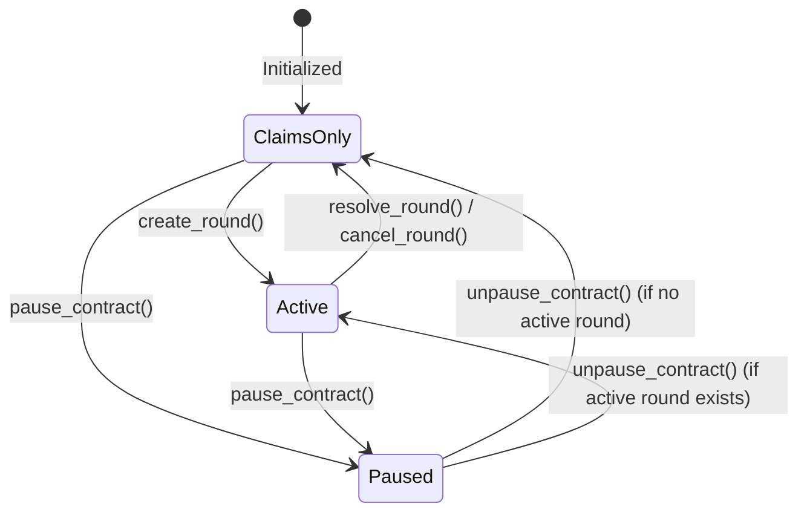
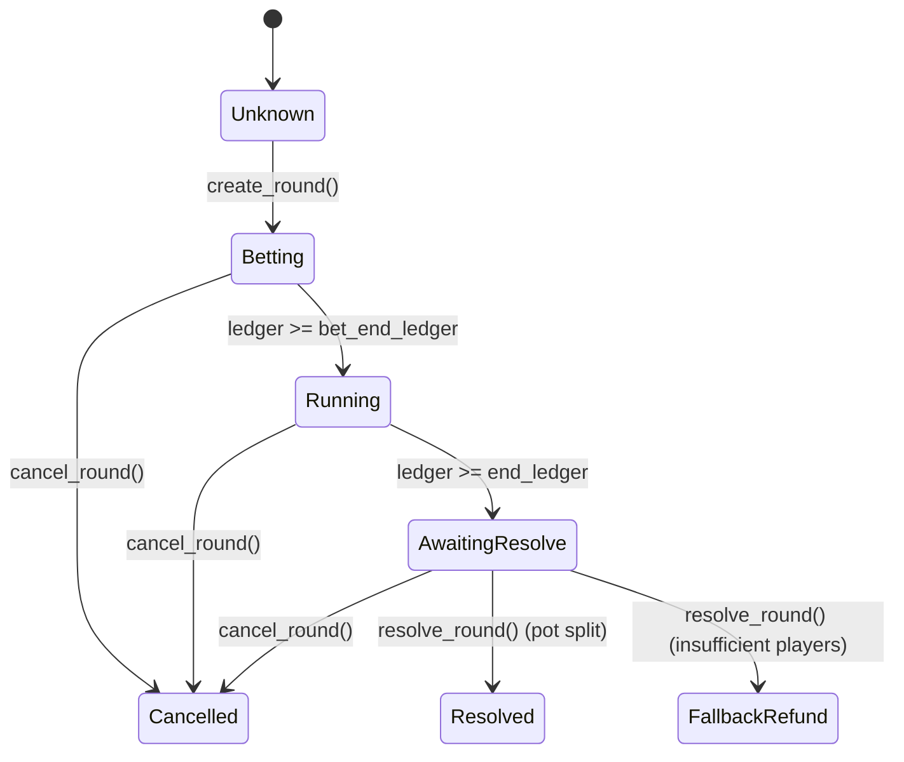

# Round Lifecycle

## States

```
                    ┌─────────────┐
                    │   Settled   │ ◄─────────────────────────────────┐
                    └─────────────┘                                    │
                           │                                           │
              create_round (admin)                          resolve_round (oracle)
                           │                                           │
                           ▼                                           │
                    ┌─────────────┐                                    │
                    │   Active    │ ───────────────────────────────────┘
                    └─────────────┘
                    Bet window open
                    (ledger < bet_end_ledger)
                           │
                    bet window closes
                    (ledger ≥ bet_end_ledger)
                           │
                    Run window closes
                    (ledger ≥ end_ledger)
```

## Phase × Action Matrix

The active phase is derived from the current ledger and has identical timing
boundaries for both round modes. `cancel_round` is the recovery edge available
from every active phase. All other denied edges return the specific contract
error shown below.

| Phase | Ledger range | Up/Down actions | Precision actions | Common terminal action | Rejected phase edges |
|---|---|---|---|---|---|
| `Betting` | `ledger < bet_end_ledger` | `place_bet` | `place_precision_prediction`, `commit_prediction` | `cancel_round` | Reveal → `InvalidRevealWindow`; resolve → `RoundNotEnded`; late bet/prediction → `RoundEnded` |
| `Running` | `bet_end_ledger ≤ ledger < end_ledger` | No new position (optional enabled `cash_out_early` only) | `reveal_prediction` | `cancel_round` | Bet/predict/commit → `RoundEnded`; resolve → `RoundNotEnded`; cross-mode action → `WrongModeForPrediction` |
| `AwaitingResolve` | `ledger ≥ end_ledger` | Settlement only | Settlement only | `resolve_round` or `cancel_round` | Bet/predict/commit → `RoundEnded`; reveal → `InvalidRevealWindow` |

Mode isolation is orthogonal to timing and is enforced in every phase: Up/Down
bets and commit/reveal actions require `RoundMode::UpDown` and `Precision` actions
require `RoundMode::Precision`; cross-mode attempts return
`WrongModeForPrediction`.

The legal state edges are identical for Up/Down and Precision:

| From | Trigger | To |
|---|---|---|
| `Unknown` | `create_round` | `Betting` |
| `Betting` | `ledger ≥ bet_end_ledger` | `Running` |
| `Running` | `ledger ≥ end_ledger` | `AwaitingResolve` |
| `AwaitingResolve` | successful competitive settlement | `Resolved` |
| `AwaitingResolve` | settlement below `min_participants` | `FallbackRefund` |
| `Betting`, `Running`, or `AwaitingResolve` | `cancel_round` | `Cancelled` |

Terminal states have no active round. A second `cancel_round` returns
`RoundNotCancellable`, while settlement after a terminal transition returns
`NoActiveRound`. A replacement round may only be created after the ledger
advances so its oracle `start_ledger` binding remains unique.

## Single-Active-Round Invariant

**At most one round may be in the Active state at any point in time.**

This is enforced by `assert_no_active_round`, a guard helper called at the
start of `create_round`, before any storage writes:

```rust
fn assert_no_active_round(env: &Env) -> Result<(), ContractError> {
    if env.storage().persistent().has(&DataKey::ActiveRound) {
        return Err(ContractError::RoundAlreadyActive);
    }
    Ok(())
}
```

If an active round is detected the function returns `ContractError::RoundAlreadyActive`
immediately. No storage keys are mutated — the round counter (`LastRoundId`)
and the existing `ActiveRound` entry both remain unchanged.

## Entrypoints That Enforce the Guard

| Entrypoint | Guard applied |
|---|---|
| `create_round` | `assert_no_active_round` before any write |

Any future entrypoint that could create a round must also call
`assert_no_active_round` before touching storage.

## Error Mapping

| Rust variant | Code | TypeScript message |
|---|---|---|
| `ContractError::RoundAlreadyActive` | 20 | `"RoundAlreadyActive"` |

## Storage Keys Affected by the Guard

| Key | Written on success | Written on failure |
|---|---|---|
| `DataKey::ActiveRound` | ✅ New round struct | ❌ Unchanged |
| `DataKey::LastRoundId` | ✅ Incremented | ❌ Unchanged |
| `DataKey::UpDownPositions` | ✅ Cleared | ❌ Unchanged |
| `DataKey::PrecisionPositions` | ✅ Cleared | ❌ Unchanged |

## Round Resolution

The oracle calls `resolve_round` after `end_ledger` is reached. On success:
- `ActiveRound` is removed — the invariant is reset and a new round can be created.
- Participant positions (`UpDownPositions`, `PrecisionPositions`) are removed.
- Pending winnings for winners are written to `PendingWinnings(address)`.

### Precision commit-reveal windows

| Phase | Ledger range | Allowed actions |
|---|---|---|
| Betting | `ledger < bet_end_ledger` | `commit_prediction`, `place_precision_prediction` |
| Reveal | `bet_end_ledger ≤ ledger < end_ledger` | `reveal_prediction` only |
| Resolve | `ledger ≥ end_ledger` | `resolve_round` |

**Unrevealed commitments:** If at least one prediction is revealed, any
still-unrevealed commitment **forfeits to the pot**. If nobody reveals,
every committed stake is **refunded** to pending winnings so funds cannot
remain locked. Admin cancel and insufficient-participant fallback also refund
unrevealed commitments.

### One-Sided Market Settlement Policy (Issue #270)

When a round ends with liquidity on only one side (e.g. `pool_up > 0` and `pool_down == 0` or vice versa), competitive settlement is impossible because there is no counter-pool.

The settlement engine deterministically executes the configured `OneSidedPolicy`:
- **`Refund` (Default):** 100% of user stakes are credited to `PendingWinnings`. No protocol fees are deducted and user win/loss statistics are preserved without artificial mutation.
- **`Void`:** Round is voided, returning full stakes to participants.
- **`CarryForward`:** Unopposed pool is carried forward to the subsequent round structure (with refund fallback if unsupported).

A dedicated `("pool", "onesided")` event is published containing `round_id`, `policy_code`, `affected_side`, `refund_amount`, `carry_amount`, `pool_up`, and `pool_down`.

## Claiming Winnings

Users call `claim_winnings` any time after a round resolves. The pending amount
is added to their balance and the `PendingWinnings` entry is removed atomically.

## Protocol and Round Statuses

The contract exposes two explicit status query endpoints for clients to monitor the protocol and round states:
- `get_protocol_status()` returns `ProtocolStatus`.
- `get_round_status(round_id)` returns `RoundStatus`.

### ProtocolStatus

The global protocol state is represented by the `ProtocolStatus` enum:

| Variant | Value | Description |
|---|---|---|
| `Active` | `0` | The contract is not paused and has a currently active round. |
| `Paused` | `1` | The contract is emergency-paused by the admin. |
| `ClaimsOnly` | `2` | The contract is not paused, but no round is active. Mutating actions are limited to claiming pending winnings. |



### RoundStatus

The status of any specific round (queried by its monotonic `round_id`) is represented by the `RoundStatus` enum:

| Variant | Value | Description |
|---|---|---|
| `Unknown` | `0` | The round does not exist, or has been pruned from the archive. |
| `Betting` | `1` | The round is active and open for betting / predictions (`ledger < bet_end_ledger`). |
| `Running` | `2` | Betting is closed, but the round is still running (`bet_end_ledger <= ledger < end_ledger`). |
| `AwaitingResolve` | `3` | The round has ended and is waiting for oracle resolution (`ledger >= end_ledger`). |
| `Resolved` | `4` | The round has been resolved normally (pot distributed to winners). |
| `Cancelled` | `5` | The round was cancelled by the admin (stakes refunded). |
| `FallbackRefund` | `6` | The round failed to meet minimum participants and was refunded at settlement. |



---

## Related

- [`docs/STATUS_CODES.md`](docs/STATUS_CODES.md) — Full status code reference with Mermaid transition diagrams,
  TypeScript usage examples, and the interaction matrix between `ProtocolStatus` and `RoundStatus`.
- [`docs/EVENT_SCHEMA.md`](docs/EVENT_SCHEMA.md) — On-chain events emitted at each lifecycle transition.
